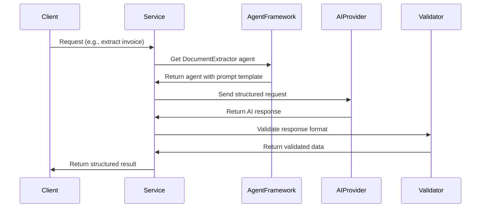
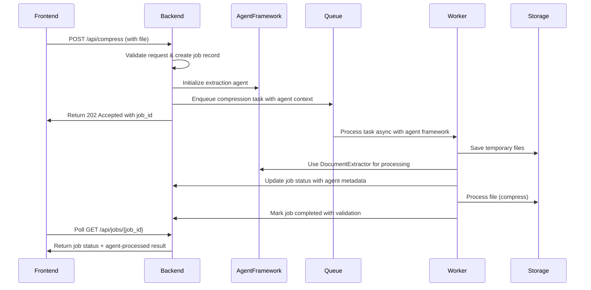

# PDF Smaller Backend API

## Overview

PDF Smaller Backend API is a Flask-based service that provides PDF compression functionality. It allows clients to upload PDF files, process them asynchronously, and download the compressed results.

**Technology Stack:**
- **Database**: SQLite (for both development and production)
- **Task Queue**: Redis + Celery
- **Storage**: Local disk (by design)
- **Framework**: Flask + SQLAlchemy

## System Architecture

### High-Level Architecture Diagram
```
┌─────────────────┐    ┌───────────────────┐    ┌──────────────────┐
│   Frontend      │    │   Python Flask     │    │   External       │
│   Client        │◄──►│   Backend API      │◄──►│   Services       │
│                 │    │                   │    │                  │
│ - Any Client    │    │ - Job Management  │    │ - Ghostscript    │
│ - Job Tracking  │    │ - Task Queue      │    │ - PDF Processing │
└─────────────────┘    └───────────────────┘    └──────────────────┘
         │                       │                       │
         │                       │                       │
┌─────────────────┐    ┌───────────────────┐    ┌──────────────────┐
│   API           │    │   Celery          │    │   Storage        │
│   Requests      │    │   Task Queue      │    │   System         │
│                 │    │                   │    │                  │
│ - REST API      │    │ - Async Tasks     │    │ - Temporary      │
│ - Job Status    │    │ - Job Processing  │    │   Files          │
└─────────────────┘    └───────────────────┘    └──────────────────┘
```

## Agent-Based AI Framework

### Overview
The system now uses a unified AgentPromptFramework for all AI-driven tasks, providing consistent processing, standardized schemas, and role-based agent definitions.

### Agent Roles
- **DocumentExtractor**: Extract structured data from documents
- **Summarizer**: Create concise text summaries
- **Translator**: Translate between languages with quality levels
- **DataValidator**: Validate and correct extracted data

### Agent-Based Workflow


### 1. Job Creation Flow (Updated)


### 2. Job Status States (Enhanced)
```
Pending → Processing → Validating → (Completed | Failed)
```

## API Endpoints Structure

### Core Job Endpoints
| Endpoint | Method | Description | Parameters |
|----------|--------|-------------|------------|
| `/api/jobs/{job_id}` | GET | Get job status | - |
| `/api/jobs/{job_id}/download` | GET | Download result | - |

### Compression Endpoints
| Endpoint | Method | Description | Parameters |
|----------|--------|-------------|------------|
| `/api/compress` | POST | Compress PDF | `file`, `compressionLevel`, `imageQuality` |
| `/api/compress/bulk` | POST | Bulk compress | `files[]`, `compressionLevel` |
| `/api/compress/preview` | POST | Get preview | `file`, `compressionLevel` |

## Data Models

### Job Model
```python
class Job(BaseModel):
    id: str = Field(default_factory=lambda: str(uuid.uuid4()))
    status: JobStatus = JobStatus.PENDING
    original_filename: str
    original_size: int
    compressed_size: Optional[int] = None
    compression_ratio: Optional[float] = None
    input_data: Dict[str, Any] = {}
    result: Optional[Dict[str, Any]] = None
    error: Optional[str] = None
    created_at: datetime = Field(default_factory=datetime.utcnow)
    updated_at: datetime = Field(default_factory=datetime.utcnow)


## Service Components

### Core Services
- **Compression Service**: PDF compression using Ghostscript
- **AI Services**: Agent-based AI processing with unified framework
- **Extraction Service**: Document data extraction using DocumentExtractor agent
- **Translation Service**: Multi-language support via Translator agent

### Infrastructure
- **Job Manager**: Tracks job status and results
- **FileManagementService**: Handles temporary file storage and cleanup operations
- **Queue Manager**: Manages async task processing
```

## 🚦 Error Handling

### Standard Error Response
```python
{
    "success": False,
    "error": {
        "code": "ERROR_CODE",
        "message": "Human readable message",
        "details": {}  # Additional context
    },
    "timestamp": "2024-01-01T00:00:00Z"
}
```

### Common Error Codes
- `VALIDATION_ERROR`: Invalid input parameters
- `FILE_TOO_LARGE`: File exceeds size limits
- `UNSUPPORTED_FORMAT`: File format not supported
- `PROCESSING_FAILED`: Processing error occurred
- `SERVICE_UNAVAILABLE`: External service unavailable
- `JOB_NOT_FOUND`: Job ID does not exist

## ⚙️ Configuration

### Environment Variables
```bash
# File Processing
UPLOAD_FOLDER=/tmp/pdf_uploads
MAX_FILE_SIZE=100000000  # 100MB

# Redis Queue
REDIS_URL=redis://localhost:6379

# Database
DATABASE_URL=sqlite:///pdf_smaller.db
```

### Rate Limiting
```python
# Simple rate limits for all users
RATE_LIMITS = {
    'default': '100/hour'
}
```

## 📊 Monitoring & Logging

### Key Metrics
- Job completion rate
- Average processing time
- Error rates by service
- File size distribution
- API response times

### Log Structure
```python
{
    "timestamp": "2024-01-01T00:00:00Z",
    "level": "INFO",
    "service": "compression",
    "job_id": "job_123",

    "event": "job_completed",
    "duration": 2.5,
    "file_size": 1024000,
    "compression_ratio": 0.65
}
```

## 🔒 Security Considerations

### 1. File Upload Security
- File type validation
- Size limits enforcement
- Virus scanning integration
- Secure temporary file handling

### 2. API Security
- CORS configuration
- Rate limiting
- Input validation
- File type validation

### 3. Data Privacy
- Temporary file cleanup
- No persistent user data storage
- Secure file processing

## 🚀 Deployment Considerations

### Infrastructure Requirements
- Python 3.9+ environment
- SQLite database (no external database server required)
- Redis for task queue and caching
- Sufficient disk space for temporary files and SQLite database
- Ghostscript for PDF processing

### Scaling Strategies
- Horizontal scaling of Celery worker processes
- Redis cluster for distributed queues
- Local disk storage with proper cleanup policies
- Load balancer for API instances
- SQLite handles concurrent reads efficiently for this use case

### Health Checks
```bash
GET /api/health
# Returns: {"status": "healthy", "database": "connected", "database_type": "sqlite"}
```