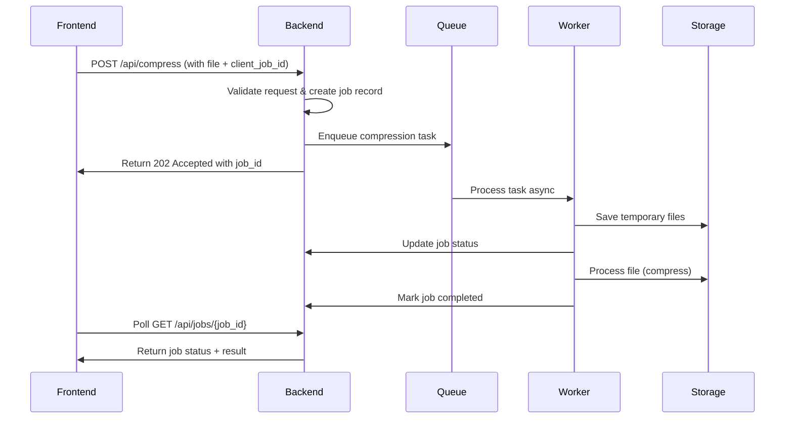

# PDF Smaller Backend API

## Overview

PDF Smaller Backend API is a Flask-based service that provides PDF compression functionality. It allows clients to upload PDF files, process them asynchronously, and download the compressed results.

## System Architecture

### High-Level Architecture Diagram
```
┌─────────────────┐    ┌───────────────────┐    ┌──────────────────┐
│   Frontend      │    │   Python Flask     │    │   External       │
│   Client        │◄──►│   Backend API      │◄──►│   Services       │
│                 │    │                   │    │                  │
│ - Any Client    │    │ - Job Management  │    │ - Ghostscript    │
│ - Job Tracking  │    │ - Task Queue      │    │ - PDF Processing │
└─────────────────┘    └───────────────────┘    └──────────────────┘
         │                       │                       │
         │                       │                       │
┌─────────────────┐    ┌───────────────────┐    ┌──────────────────┐
│   API           │    │   Celery          │    │   Storage        │
│   Requests      │    │   Task Queue      │    │   System         │
│                 │    │                   │    │                  │
│ - REST API      │    │ - Async Tasks     │    │ - Temporary      │
│ - Job Status    │    │ - Job Processing  │    │   Files          │
└─────────────────┘    └───────────────────┘    └──────────────────┘
```

## Job-Oriented Workflow

### 1. Job Creation Flow


### 2. Job Status States
```
Pending → Processing → (Completed | Failed)
```

## API Endpoints Structure

### Core Job Endpoints
| Endpoint | Method | Description | Parameters |
|----------|--------|-------------|------------|
| `/api/jobs/{job_id}` | GET | Get job status | - |
| `/api/jobs/{job_id}/download` | GET | Download result | - |

### Compression Endpoints
| Endpoint | Method | Description | Parameters |
|----------|--------|-------------|------------|
| `/api/compress` | POST | Compress PDF | `file`, `compressionLevel`, `imageQuality`, `client_job_id` |
| `/api/compress/bulk` | POST | Bulk compress | `files[]`, `compressionLevel`, `client_job_id` |
| `/api/compress/preview` | POST | Get preview | `file`, `compressionLevel` |

## Data Models

### Job Model
```python
class CompressionJob(BaseModel):
    id: str = Field(default_factory=lambda: str(uuid.uuid4()))
    status: JobStatus = JobStatus.PENDING
    client_job_id: Optional[str] = None
    original_filename: str
    original_size: int
    compressed_size: Optional[int] = None
    compression_ratio: Optional[float] = None
    input_data: Dict[str, Any] = {}
    result: Optional[Dict[str, Any]] = None
    error: Optional[str] = None
    created_at: datetime = Field(default_factory=datetime.utcnow)
    updated_at: datetime = Field(default_factory=datetime.utcnow)


## Service Components

### Core Services
- **Compression Service**: PDF compression using Ghostscript

### Infrastructure
- **Job Manager**: Tracks job status and results
- **File Manager**: Handles temporary file storage
- **Queue Manager**: Manages async task processing
```

## 🚦 Error Handling

### Standard Error Response
```python
{
    "success": False,
    "error": {
        "code": "ERROR_CODE",
        "message": "Human readable message",
        "details": {}  # Additional context
    },
    "timestamp": "2024-01-01T00:00:00Z"
}
```

### Common Error Codes
- `VALIDATION_ERROR`: Invalid input parameters
- `FILE_TOO_LARGE`: File exceeds size limits
- `UNSUPPORTED_FORMAT`: File format not supported
- `PROCESSING_FAILED`: Processing error occurred
- `SERVICE_UNAVAILABLE`: External service unavailable
- `JOB_NOT_FOUND`: Job ID does not exist

## ⚙️ Configuration

### Environment Variables
```bash
# OpenRouter AI Configuration
OPENROUTER_API_KEY=your_openrouter_api_key
OPENROUTER_BASE_URL=https://openrouter.ai/api/v1
OPENROUTER_DEFAULT_MODEL=openai/gpt-3.5-turbo

# File Processing
UPLOAD_FOLDER=/tmp/pdf_uploads
MAX_FILE_SIZE=100000000  # 100MB

# Redis Queue
REDIS_URL=redis://localhost:6379
```

### Rate Limiting
```python
# Tier-based rate limits
RATE_LIMITS = {
    'anonymous': '10/hour',
    'free': '50/hour',
    'premium': '1000/hour',
    'pro': '5000/hour'
}
```

## 📊 Monitoring & Logging

### Key Metrics
- Job completion rate
- Average processing time
- Error rates by service
- File size distribution
- API response times

### Log Structure
```python
{
    "timestamp": "2024-01-01T00:00:00Z",
    "level": "INFO",
    "service": "compression",
    "job_id": "job_123",
    "client_job_id": "user_123",
    "event": "job_completed",
    "duration": 2.5,
    "file_size": 1024000,
    "compression_ratio": 0.65
}
```

## 🔒 Security Considerations

### 1. File Upload Security
- File type validation
- Size limits enforcement
- Virus scanning integration
- Secure temporary file handling

### 2. API Security
- CORS configuration
- Rate limiting
- Input validation
- Authentication (JWT optional)

### 3. Data Privacy
- Temporary file cleanup
- No persistent user data storage
- Secure AI API communications

## 🚀 Deployment Considerations

### Infrastructure Requirements
- Python 3.9+ environment
- Redis for task queue
- Sufficient disk space for temporary files
- Network access to OpenRouter API

### Scaling Strategies
- Horizontal scaling of worker processes
- Redis cluster for distributed queues
- CDN for file downloads
- Load balancer for API instances

### Health Checks
```bash
GET /api/health
# Returns: {"status": "healthy", "services": {"redis": true, "openrouter": true}}
```