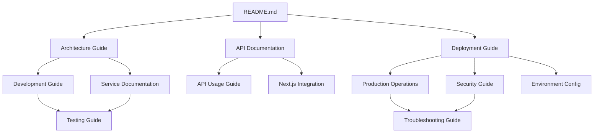

# PDF Smaller Backend - Documentation Index

**Version:** 1.0  
**Last Updated:** January 2025  
**Status:** Active  
**Maintainer:** Development Team  

## Overview

This documentation index provides comprehensive navigation for the PDF Smaller Backend project. All documentation follows standardized formatting and production-ready practices to ensure reliable deployment and operations.

## 🚀 Quick Start

| For... | Start Here | Next Steps |
|--------|------------|------------|
| **New Developers** | [Development Guide](development_guide.md) | [Architecture Guide](architecture_guide.md) → [API Documentation](api_documentation.md) |
| **DevOps Engineers** | [Deployment Guide](deployment_guide.md) | [Production Operations](production_operations_guide.md) → [Security Guide](security_guide.md) |
| **API Consumers** | [API Usage Guide](api_usage_guide.md) | [API Documentation](api_documentation.md) → [Next.js Integration](api_usage_nextjs.md) |
| **System Administrators** | [Production Operations](production_operations_guide.md) | [Troubleshooting Guide](troubleshooting_guide.md) → [Security Guide](security_guide.md) |

## 📚 Core Documentation

### System Architecture & Design

| Document | Status | Description | Audience |
|----------|--------|-------------|----------|
| [Architecture Guide](architecture_guide.md) | ✅ Production Ready | System architecture, components, and data flow | Developers, DevOps |
| [API Documentation](api_documentation.md) | ✅ Production Ready | Complete API reference with endpoints and examples | Developers, API Consumers |
| [API Specification](api_specification.yaml) | ✅ Production Ready | OpenAPI 3.0 specification for automated tooling | Developers, Tools |

### Development & Testing

| Document | Status | Description | Audience |
|----------|--------|-------------|----------|
| [Development Guide](development_guide.md) | ✅ Production Ready | Local development setup and practices | Developers |
| [Testing Guide](testing_guide.md) | ✅ Production Ready | Testing strategies and procedures | Developers, QA |
| [Service Documentation](service_documentation.md) | ✅ Production Ready | Individual service implementations | Developers |
| [Job Manager Documentation](job_manager_documentation.md) | ✅ Production Ready | Asynchronous job processing system | Developers |

### Deployment & Operations

| Document | Status | Description | Audience |
|----------|--------|-------------|----------|
| [Deployment Guide](deployment_guide.md) | ✅ Production Ready | Complete deployment procedures | DevOps, SysAdmins |
| [Production Operations Guide](production_operations_guide.md) | 🔄 In Development | Operational runbook for production | DevOps, SysAdmins |
| [Environment Configuration](environment_configuration.md) | ✅ Production Ready | Configuration management | DevOps, Developers |
| [Security Guide](security_guide.md) | ✅ Production Ready | Security implementation and best practices | DevOps, Security |

### API Integration & Usage

| Document | Status | Description | Audience |
|----------|--------|-------------|----------|
| [API Usage Guide](api_usage_guide.md) | ✅ Production Ready | General API integration guide | API Consumers |
| [Next.js Integration Guide](api_usage_nextjs.md) | ✅ Production Ready | Next.js specific integration examples | Frontend Developers |

### Troubleshooting & Support

| Document | Status | Description | Audience |
|----------|--------|-------------|----------|
| [Troubleshooting Guide](troubleshooting_guide.md) | ✅ Production Ready | Common issues and solutions | All Users |

## 🔧 Specialized Documentation

### AI Features

| Document | Status | Description | Audience |
|----------|--------|-------------|----------|
| [AI Extraction Features](ai_features/extraction_features.md) | ✅ Production Ready | AI-powered document extraction capabilities | Developers, API Consumers |

### Specifications & Standards

| Document | Status | Description | Audience |
|----------|--------|-------------|----------|
| [Documentation Refresh Spec](DOCUMENTATION_REFRESH_SPEC.md) | ✅ Active | Master specification for documentation standards | Documentation Team |
| [Production Readiness Audit](specs/PRODUCTION_READINESS_AUDIT.md) | 🔄 In Development | Production readiness evaluation criteria | DevOps, Management |
| [Documentation Standards](specs/DOCUMENTATION_STANDARDS.md) | 🔄 In Development | Documentation formatting and quality standards | Documentation Team |

### Task Management

| Document | Status | Description | Audience |
|----------|--------|-------------|----------|
| [Tasks Module Documentation](tasks_module.md) | ✅ Production Ready | Celery task system implementation | Developers |

## 📊 Documentation Maturity Levels

### Status Indicators

- ✅ **Production Ready**: Comprehensive, tested, and maintained
- 🔄 **In Development**: Actively being updated or created
- ⚠️ **Needs Review**: Requires accuracy verification
- 🚧 **Under Construction**: Significant work in progress
- ❌ **Deprecated**: No longer maintained or relevant

### Quality Criteria

**Production Ready** documents meet these criteria:
- 100% accuracy with current implementation
- Complete coverage of all major use cases
- Tested examples and procedures
- Consistent formatting and structure
- Regular maintenance and updates

## 🎯 Production Readiness Focus

### Critical Path Documentation

For production deployment, ensure these documents are thoroughly reviewed:

1. **[Deployment Guide](deployment_guide.md)** - Complete deployment procedures
2. **[Production Operations Guide](production_operations_guide.md)** - Operational runbook
3. **[Security Guide](security_guide.md)** - Security implementation
4. **[Troubleshooting Guide](troubleshooting_guide.md)** - Issue resolution
5. **[API Documentation](api_documentation.md)** - Complete API reference

### Operational Excellence

The documentation supports these operational principles:

- **Reliability**: Comprehensive troubleshooting and monitoring guidance
- **Security**: Detailed security implementation and best practices
- **Maintainability**: Clear development and testing procedures
- **Scalability**: Architecture and deployment patterns for growth
- **Observability**: Logging, monitoring, and alerting strategies

## 🔍 Navigation Tips

### Finding Information Quickly

1. **Use the Quick Start table** above for role-based entry points
2. **Check document status** to ensure you're reading current information
3. **Follow cross-references** within documents for related topics
4. **Use the search function** in your editor or browser for specific terms

### Document Relationships

## 📝 Contributing to Documentation

### Documentation Standards

All documentation follows the standards defined in [DOCUMENTATION_REFRESH_SPEC.md](DOCUMENTATION_REFRESH_SPEC.md):

- **Markdown Format**: GitHub-flavored Markdown with consistent structure
- **Accuracy**: All examples tested against current implementation
- **Completeness**: Comprehensive coverage of topics
- **Clarity**: Clear, concise language for technical audiences
- **Cross-References**: Proper linking between related documents

### Update Procedures

1. **Verify Current State**: Ensure changes reflect actual implementation
2. **Follow Standards**: Use consistent formatting and structure
3. **Test Examples**: Verify all code examples and procedures
4. **Update Cross-References**: Maintain accurate links and references
5. **Review Process**: Technical and editorial review before publication

### Maintenance Schedule

- **Monthly Reviews**: Accuracy verification against codebase
- **Quarterly Updates**: Comprehensive review and refresh
- **Release Updates**: Documentation updates with each system release
- **Continuous Improvement**: Ongoing feedback integration

## 📞 Support & Feedback

### Getting Help

1. **Check [Troubleshooting Guide](troubleshooting_guide.md)** for common issues
2. **Review relevant documentation** using this index
3. **Search existing documentation** for specific topics
4. **Contact the development team** for documentation feedback

### Reporting Issues

When reporting documentation issues, please include:

- **Document name and section** where the issue occurs
- **Expected vs. actual behavior** if following procedures
- **Environment details** (OS, versions, configuration)
- **Suggested improvements** or corrections

---

**Document Control**
- **Created:** January 2025
- **Last Modified:** January 2025
- **Next Review:** February 2025
- **Approved By:** Development Team
- **Distribution:** All team members, stakeholders

**Navigation:** [🏠 Project Root](../README.md) | [📋 Documentation Standards](DOCUMENTATION_REFRESH_SPEC.md) | [🔧 Production Operations](production_operations_guide.md)