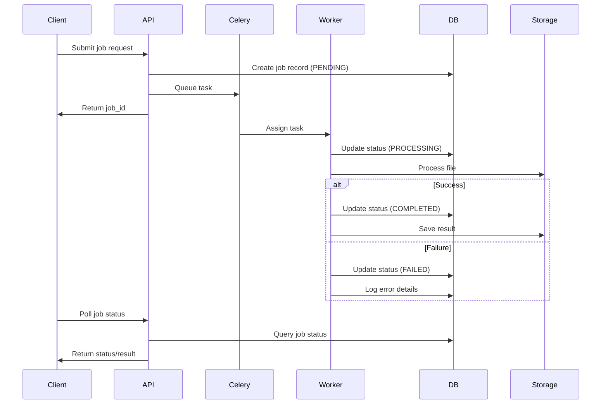
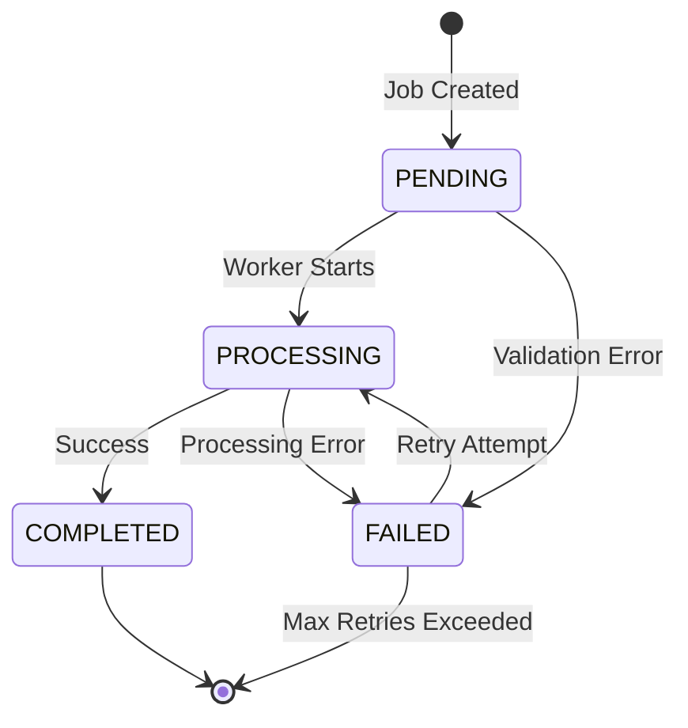

# Tasks Module Documentation

## Overview

The tasks module provides asynchronous task processing capabilities for the PDF processing service using Celery. It handles various PDF operations including compression, conversion, OCR, AI-powered extraction, and file management operations through a distributed task queue system.

## Task Catalog

### Core Processing Tasks

#### Compression Tasks
- **`compress_task`** - Compresses PDF files using various algorithms
  - Queue: `compression`
  - Retry: 3 attempts with exponential backoff
  - Input: File path, compression settings
  - Output: Compressed file metadata

- **`bulk_compress_task`** - Handles batch compression operations
  - Queue: `compression`
  - Processes multiple files in sequence
  - Implements progress tracking per file

#### Conversion Tasks
- **`convert_task`** - Converts PDFs to various formats (images, text)
  - Queue: `conversion`
  - Supports multiple output formats
  - Handles large file streaming

#### OCR Tasks
- **`ocr_task`** - Optical Character Recognition processing
  - Queue: `ocr`
  - Extracts text from scanned PDFs
  - Language detection and processing

#### AI Processing Tasks
- **`ai_task`** - General AI processing operations
  - Queue: `ai`
  - Integrates with external AI services
  - Handles structured data extraction

- **`extract_bank_statement_task`** - Bank statement data extraction
  - Queue: `ai`
  - Specialized for financial document processing
  - Validates extracted financial data

#### File Operations
- **`merge_pdf_task`** - Merges multiple PDF files
  - Queue: `file_ops`
  - Maintains document metadata
  - Handles large file combinations

- **`split_pdf_task`** - Splits PDF into separate files
  - Queue: `file_ops`
  - Page range specifications
  - Preserves document structure

### Maintenance Tasks

#### Periodic Cleanup
- **`cleanup_temp_files_task`** - Removes temporary files
  - Schedule: Every 30 minutes
  - Configurable retention policies
  - Disk space management

- **`cleanup_expired_jobs_task`** - Cleans up old job records
  - Schedule: Daily at 2:00 AM
  - Configurable retention period
  - Database optimization

#### System Health
- **`health_check_task`** - System health monitoring
  - Schedule: Every 5 minutes
  - Service availability checks
  - Performance metrics collection

## Architecture

### Task Queue Configuration

```python
# Queue routing configuration
CELERY_TASK_ROUTES = {
    'src.tasks.tasks.compress_task': {'queue': 'compression'},
    'src.tasks.tasks.bulk_compress_task': {'queue': 'compression'},
    'src.tasks.tasks.convert_task': {'queue': 'conversion'},
    'src.tasks.tasks.ocr_task': {'queue': 'ocr'},
    'src.tasks.tasks.ai_task': {'queue': 'ai'},
    'src.tasks.tasks.extract_bank_statement_task': {'queue': 'ai'},
    'src.tasks.tasks.merge_pdf_task': {'queue': 'file_ops'},
    'src.tasks.tasks.split_pdf_task': {'queue': 'file_ops'},
    'src.tasks.tasks.cleanup_temp_files_task': {'queue': 'maintenance'},
    'src.tasks.tasks.health_check_task': {'queue': 'maintenance'}
}
```

### Task Flow Sequence



### Error Handling Architecture

#### Error Classification
- **Retryable Errors**: Network timeouts, temporary service unavailability
- **Non-Retryable Errors**: Validation failures, malformed files, authentication errors
- **Critical Errors**: Database failures, configuration issues

#### Retry Strategy
```python
# Exponential backoff with jitter
retry_delays = [60, 180, 600]  # 1min, 3min, 10min
max_retries = 3
jitter = True  # Adds randomization to prevent thundering herd
```

## Job Management

### Job Lifecycle States

```python
class JobStatus(Enum):
    PENDING = 'pending'      # Initial state, queued for processing
    PROCESSING = 'processing' # Currently being processed
    COMPLETED = 'completed'   # Successfully completed
    FAILED = 'failed'        # Processing failed
```

### State Transitions



### Job Operations Utility

The `JobOperations` class provides safe database operations with transaction management and is the recommended way to handle job lifecycle operations:

```python
from src.utils.job_operations import JobOperations

# Create new job with transaction safety
job = JobOperations.create_job_safely(
    job_id="unique_job_id",
    job_type='compress',
    input_data={'file_path': '/path/to/file.pdf'}
)

# Update job status safely
JobOperations.update_job_status(job_id, JobStatus.PROCESSING)

# Mark job as completed with results
JobOperations.update_job_status(job_id, JobStatus.COMPLETED, result=result_data)
```

### Legacy JobStatusManager (Deprecated)

**Note:** The legacy `JobStatusManager` class is deprecated. All new development should use `JobOperations`.

| Legacy (Deprecated) | New (Recommended) |
|---------------------|-------------------|
| `JobStatusManager.get_or_create_job()` | `JobOperations.create_job_safely()` |
| `JobStatusManager.update_job_status()` | `JobOperations.update_job_status()` |
| Parameter: `task_type` | Parameter: `job_type` |

### Database Transaction Management

All job operations use the `db_transaction` context manager for data consistency:

```python
from src.utils.transaction_utils import db_transaction

with db_transaction(description="Update job status"):
    job = Job.query.get(job_id)
    job.status = 'completed'
    job.result = result_data
    # Automatic commit on success, rollback on exception
```

## Service Integration

### Service Registry Pattern

Tasks use the `ServiceRegistry` for consistent service instantiation:

```python
from src.services.service_registry import ServiceRegistry

# Get service instances
compression_service = ServiceRegistry.get_compression_service()
ai_service = ServiceRegistry.get_ai_service()
file_service = ServiceRegistry.get_file_management_service()
```

### Available Services

- **CompressionService**: PDF compression algorithms
- **ConversionService**: Format conversion operations
- **OCRService**: Text extraction from images
- **AIService**: AI-powered document analysis
- **FileManagementService**: File operations and storage
- **ExportService**: Data export in various formats
- **InvoiceExtractionService**: Invoice-specific AI extraction
- **BankStatementExtractionService**: Financial document processing

## Error Handling

### Exception Hierarchy

```python
PDFCompressionError (Base)
├── ValidationError (400)
├── AuthenticationError (401)
├── AuthorizationError (403)
├── ResourceNotFoundError (404)
├── FileProcessingError (422)
├── RateLimitExceededError (429)
├── ExternalServiceError (503)
├── DatabaseError (500)
├── SecurityError (403)
├── ExtractionError (422)
│   └── ExtractionValidationError
└── ExportError (422)
```

### Task Error Handling

```python
@celery_app.task(bind=True, max_retries=3)
def example_task(self, job_id, input_data):
    try:
        with db_transaction(description=f"Process job {job_id}"):
            # Update job status to processing
            JobOperations.update_status(job_id, 'processing')
            
            # Perform task operations
            result = process_data(input_data)
            
            # Mark as completed
            JobOperations.mark_completed(job_id, result)
            
    except RetryableError as e:
        # Retry with exponential backoff
        raise self.retry(countdown=calculate_retry_delay(self.request.retries))
    
    except NonRetryableError as e:
        # Mark as failed, don't retry
        JobOperations.mark_failed(job_id, str(e))
        raise
```

## Celery Configuration

### Worker Configuration

```python
# Worker settings
CELERY_WORKER_CONCURRENCY = 4
CELERY_WORKER_PREFETCH_MULTIPLIER = 1
CELERY_WORKER_MAX_TASKS_PER_CHILD = 1000

# Task execution settings
CELERY_TASK_SOFT_TIME_LIMIT = 300  # 5 minutes
CELERY_TASK_TIME_LIMIT = 600       # 10 minutes
CELERY_TASK_ACKS_LATE = True
CELERY_WORKER_DISABLE_RATE_LIMITS = False
```

### Result Backend

```python
# Redis result backend
CELERY_RESULT_BACKEND = 'redis://localhost:6379/1'
CELERY_RESULT_EXPIRES = 3600  # 1 hour
CELERY_RESULT_PERSISTENT = True
```

### Beat Schedule (Periodic Tasks)

```python
CELERY_BEAT_SCHEDULE = {
    'cleanup-expired-jobs': {
        'task': 'src.tasks.tasks.cleanup_expired_jobs_task',
        'schedule': crontab(hour=2, minute=0),  # Daily at 2:00 AM
    },
    'cleanup-temp-files': {
        'task': 'src.tasks.tasks.cleanup_temp_files_task',
        'schedule': crontab(minute='*/30'),  # Every 30 minutes
    },
    'health-check': {
        'task': 'src.tasks.tasks.health_check_task',
        'schedule': crontab(minute='*/5'),  # Every 5 minutes
    }
}
```

## Progress Reporting

### Task Progress Updates

```python
@celery_app.task(bind=True)
def long_running_task(self, job_id, input_data):
    total_steps = 100
    
    for i in range(total_steps):
        # Update progress
        self.update_state(
            state='PROGRESS',
            meta={
                'current': i,
                'total': total_steps,
                'status': f'Processing step {i+1}'
            }
        )
        
        # Perform work step
        process_step(i)
    
    return {'status': 'completed', 'result': 'success'}
```

### Progress Monitoring

```python
# Check task progress
result = celery_app.AsyncResult(task_id)
if result.state == 'PROGRESS':
    progress = result.info
    print(f"Progress: {progress['current']}/{progress['total']}")
    print(f"Status: {progress['status']}")
```

## File and Resource Management

### Cleanup Patterns

#### Temporary File Cleanup
- **Automatic cleanup**: Files older than 24 hours
- **Manual cleanup**: Via `cleanup_temp_files_task`
- **Error handling**: Graceful handling of locked files

#### Job Record Cleanup
- **Retention policy**: 30 days for completed jobs
- **Failed jobs**: 7 days retention
- **Batch processing**: 1000 records per cleanup cycle

### Resource Monitoring

```python
# Disk space monitoring
def check_disk_space():
    usage = shutil.disk_usage('/')
    free_percent = (usage.free / usage.total) * 100
    
    if free_percent < 10:  # Less than 10% free
        trigger_emergency_cleanup()
```

## Usage Examples

### Task Invocation

```python
# Synchronous task execution (for testing)
result = compress_task.apply(args=[job_id, input_data])

# Asynchronous task execution (production)
task_result = compress_task.delay(job_id, input_data)
task_id = task_result.id

# Scheduled task execution
compress_task.apply_async(
    args=[job_id, input_data],
    countdown=60  # Execute in 60 seconds
)
```

### Status Checking

```python
# Check job status via database
job = Job.query.get(job_id)
print(f"Job {job_id} status: {job.status}")

# Check Celery task status
result = celery_app.AsyncResult(task_id)
print(f"Task {task_id} state: {result.state}")
```

### Failure Handling

```python
# Handle task failures
if job.status == 'failed':
    print(f"Job failed: {job.error}")
    
    # Retry if appropriate
    if should_retry_job(job):
        new_task = compress_task.delay(job_id, job.input_data)
        job.task_id = new_task.id
        job.status = 'pending'
        db.session.commit()
```

## Development Guidelines

### Best Practices

1. **Transaction Safety**: Always use `db_transaction` for database operations
2. **Error Classification**: Properly categorize errors as retryable or non-retryable
3. **Resource Cleanup**: Ensure temporary files are cleaned up in finally blocks
4. **Progress Reporting**: Provide progress updates for long-running tasks
5. **Service Integration**: Use `ServiceRegistry` for consistent service access

### Consistency Patterns

1. **Job Status Updates**: Use `JobOperations` utility methods
2. **Error Handling**: Follow the established exception hierarchy
3. **Logging**: Include job_id and task_id in all log messages
4. **Configuration**: Use environment variables for all configurable values

### Testing Recommendations

1. **Unit Tests**: Test task logic with mocked services
2. **Integration Tests**: Test with actual Celery workers
3. **Error Scenarios**: Test retry logic and failure handling
4. **Performance Tests**: Validate task execution times
5. **Cleanup Tests**: Verify resource cleanup operations

## Related Files

- **Task Implementation**: `src/tasks/tasks.py`
- **Celery Configuration**: `src/celery_app.py`
- **Job Model**: `src/models/job.py`
- **Service Registry**: `src/services/service_registry.py`
- **Transaction Utils**: `src/utils/transaction_utils.py`
- **Job Operations**: `src/utils/job_operations.py`
- **Exception Classes**: `src/utils/exceptions.py`
- **Database Helpers**: `src/utils/database_helpers.py`
