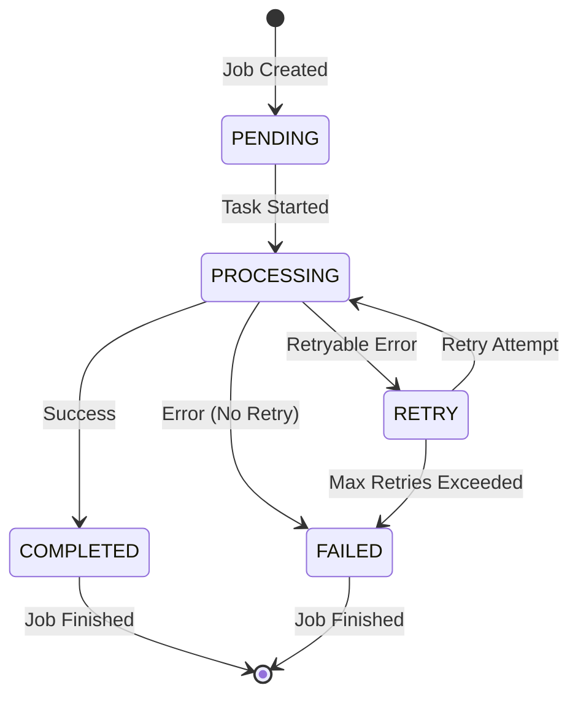

# Tasks Module Documentation

This document provides comprehensive documentation for the PDF Smaller backend tasks module, which handles all background processing operations including PDF compression, conversion, OCR, AI-powered extraction, and system maintenance tasks.

## Table of Contents

1. [Overview](#overview)
2. [Task Catalog](#task-catalog)
3. [Architecture and Patterns](#architecture-and-patterns)
4. [Job Management](#job-management)
5. [Error Handling and Retry Logic](#error-handling-and-retry-logic)
6. [Service Integration](#service-integration)
7. [Celery Configuration](#celery-configuration)
8. [Progress Reporting](#progress-reporting)
9. [File and Resource Management](#file-and-resource-management)
10. [Usage Examples](#usage-examples)
11. [Development Guidelines](#development-guidelines)

## Overview

The tasks module (<mcfile name="tasks.py" path="src/tasks/tasks.py"></mcfile>) serves as the backbone of the PDF Smaller backend's asynchronous processing system. Built on Celery, it provides a robust framework for handling long-running operations while maintaining system responsiveness and reliability.

### Key Features

- **Asynchronous Processing**: All heavy operations run in background workers
- **Job Lifecycle Management**: Complete tracking from creation to completion
- **Intelligent Error Handling**: Context-aware retry logic and failure management
- **Progress Reporting**: Real-time status updates for long-running tasks
- **Resource Management**: Automatic cleanup and resource optimization
- **Service Integration**: Seamless integration with all backend services

### Architecture Components

- **Task Definitions**: Individual task implementations in <mcfile name="tasks.py" path="src/tasks/tasks.py"></mcfile>
- **Celery Configuration**: Worker and broker settings in <mcfile name="celery_app.py" path="src/celery_app.py"></mcfile>
- **Job Model**: Database persistence via <mcfile name="job.py" path="src/models/job.py"></mcfile>
- **Custom Exceptions**: Error handling through <mcfile name="exceptions.py" path="src/utils/exceptions.py"></mcfile>

## Task Catalog

The tasks module contains 12 distinct tasks organized by functional category:

### Compression Tasks

| Task Name | Purpose | Input Parameters | Output Format | Dependencies | Retry Policy |
|-----------|---------|------------------|---------------|--------------|-------------|
| `compress_pdf_task` | PDF compression with quality settings | `job_id`, `compression_level`, `custom_settings` | Compressed PDF file | CompressionService, Ghostscript | 3 retries, 60s countdown |
| `bulk_compress_task` | Batch compression of multiple PDFs | `job_id`, `file_list`, `compression_settings` | ZIP archive with compressed files | CompressionService | 3 retries, 60s countdown |

### Conversion Tasks

| Task Name | Purpose | Input Parameters | Output Format | Dependencies | Retry Policy |
|-----------|---------|------------------|---------------|--------------|-------------|
| `convert_to_images_task` | PDF to image conversion | `job_id`, `format`, `dpi`, `page_range` | Image files (PNG/JPEG) | ConversionService, Ghostscript | 3 retries, 60s countdown |
| `merge_pdfs_task` | Combine multiple PDFs | `job_id`, `file_list`, `merge_options` | Single merged PDF | ConversionService | 3 retries, 60s countdown |
| `split_pdf_task` | Split PDF into separate files | `job_id`, `split_options`, `page_ranges` | Multiple PDF files | ConversionService | 3 retries, 60s countdown |

### OCR Tasks

| Task Name | Purpose | Input Parameters | Output Format | Dependencies | Retry Policy |
|-----------|---------|------------------|---------------|--------------|-------------|
| `ocr_pdf_task` | Extract text from scanned PDFs | `job_id`, `language`, `ocr_options` | Searchable PDF + text | OCRService, Tesseract | 3 retries, 60s countdown |
| `extract_text_task` | Text extraction from PDFs | `job_id`, `extraction_options` | Plain text or structured data | OCRService | 3 retries, 60s countdown |

### AI-Powered Extraction Tasks

| Task Name | Purpose | Input Parameters | Output Format | Dependencies | Retry Policy |
|-----------|---------|------------------|---------------|--------------|-------------|
| `extract_invoice_data_task` | AI invoice data extraction | `job_id`, `extraction_config` | Structured invoice data (JSON) | InvoiceExtractionService, AI Service | 2 retries, 60s countdown |
| `extract_bank_statement_task` | AI bank statement processing | `job_id`, `extraction_config` | Structured transaction data (JSON) | BankStatementExtractionService, AI Service | 2 retries, 60s countdown |

### Maintenance Tasks

| Task Name | Purpose | Input Parameters | Output Format | Dependencies | Retry Policy |
|-----------|---------|------------------|---------------|--------------|-------------|
| `cleanup_expired_jobs_task` | Remove old job records and files | `retention_days` | Cleanup summary | CleanupService | No retry (runs periodically) |
| `cleanup_temp_files_task` | Clean temporary processing files | `max_age_hours` | Cleanup summary | CleanupService | No retry (runs periodically) |
| `health_check_task` | System health monitoring | None | System status report | All services | No retry (monitoring only) |

## Architecture and Patterns

### Common Task Execution Pattern

All tasks follow a standardized execution pattern for consistency and reliability:

```python
@celery.task(bind=True, base=ContextTask)
def example_task(self, job_id: str, **kwargs):
    """Standard task implementation pattern"""
    job = None
    try:
        # 1. Job initialization and validation
        job = Job.query.get(job_id)
        if not job:
            raise ValueError(f"Job {job_id} not found")
        
        # 2. Mark job as processing
        job.mark_as_processing()
        
        # 3. Progress reporting setup
        self.update_state(
            state='PROGRESS',
            meta={'current': 0, 'total': 100, 'status': 'Starting...'}
        )
        
        # 4. Service instantiation and processing
        service = ServiceClass()
        result = service.process_method(job.input_file_path, **kwargs)
        
        # 5. Progress updates during processing
        self.update_state(
            state='PROGRESS',
            meta={'current': 50, 'total': 100, 'status': 'Processing...'}
        )
        
        # 6. Result handling and job completion
        job.mark_as_completed(result)
        
        return {
            'status': 'completed',
            'result': result,
            'job_id': job_id
        }
        
    except Exception as e:
        # 7. Error handling with context-safe updates
        if job:
            job.mark_as_failed(str(e))
        
        # 8. Retry logic based on error type
        if should_retry(e) and self.request.retries < self.max_retries:
            countdown = 60 * (self.request.retries + 1)
            raise self.retry(countdown=countdown, exc=e)
        
        raise e
```

### Job Lifecycle Management

Tasks manage job states through a well-defined lifecycle:



### Progress Reporting Schema

All tasks use a standardized progress reporting format:

```python
# Standard progress metadata structure
progress_meta = {
    'current': 45,           # Current progress value
    'total': 100,           # Total progress value
    'status': 'Processing page 3 of 10',  # Human-readable status
    'stage': 'compression', # Current processing stage
    'details': {            # Stage-specific details
        'pages_processed': 3,
        'estimated_time': '2 minutes'
    }
}

# Update task state with progress
self.update_state(state='PROGRESS', meta=progress_meta)
```

### Flask Application Context Handling

Tasks use the `ContextTask` base class to ensure proper Flask application context:

```python
from src.tasks.app_context import ContextTask

@celery.task(bind=True, base=ContextTask)
def task_with_context(self, job_id):
    # Flask app context is automatically available
    # Database operations work correctly
    job = Job.query.get(job_id)
    # ... task implementation
```

## Job Management

### Job Model Integration

Tasks integrate closely with the Job model (<mcfile name="job.py" path="src/models/job.py"></mcfile>) for persistent state management:

```python
# Job model key attributes
class Job(db.Model):
    job_id = db.Column(db.String(36), primary_key=True)
    status = db.Column(db.Enum(JobStatus), default=JobStatus.PENDING)
    task_name = db.Column(db.String(100), nullable=False)
    input_file_path = db.Column(db.String(500))
    output_file_path = db.Column(db.String(500))
    result_data = db.Column(db.JSON)
    error_message = db.Column(db.Text)
    progress = db.Column(db.Integer, default=0)
    created_at = db.Column(db.DateTime, default=datetime.utcnow)
    completed_at = db.Column(db.DateTime)
```

### JobStatus Enum Values

```python
class JobStatus(Enum):
    PENDING = "pending"       # Job created, waiting for processing
    PROCESSING = "processing" # Currently being processed by worker
    COMPLETED = "completed"   # Successfully completed
    FAILED = "failed"         # Failed with error
    CANCELLED = "cancelled"   # Manually cancelled
    RETRY = "retry"          # Scheduled for retry
```

### Job Helper Methods

Tasks use standardized helper methods for job state management:

```python
# Mark job as processing
def mark_as_processing(self):
    """Update job status to PROCESSING with timestamp"""
    self.status = JobStatus.PROCESSING
    self.started_at = datetime.utcnow()
    db.session.commit()

# Mark job as completed
def mark_as_completed(self, result_data=None):
    """Update job status to COMPLETED with result data"""
    self.status = JobStatus.COMPLETED
    self.completed_at = datetime.utcnow()
    self.progress = 100
    if result_data:
        self.result_data = result_data
    db.session.commit()

# Mark job as failed
def mark_as_failed(self, error_message):
    """Update job status to FAILED with error details"""
    self.status = JobStatus.FAILED
    self.completed_at = datetime.utcnow()
    self.error_message = error_message
    db.session.commit()
```

## Error Handling and Retry Logic

### Three-Tier Error Handling Pattern

Tasks implement a sophisticated three-tier error handling approach:

#### Tier 1: Context-Safe Error Updates
```python
try:
    # Task processing logic
    pass
except Exception as e:
    # Always attempt to update job status, even if DB is problematic
    try:
        if job:
            job.mark_as_failed(str(e))
    except Exception as db_error:
        # Log database error but don't mask original error
        logger.error(f"Failed to update job status: {db_error}")
    
    # Continue with retry logic
    raise e
```

#### Tier 2: Intelligent Retry Logic
```python
# Determine if error should trigger retry
def should_retry(exception):
    """Determine if exception warrants a retry attempt"""
    non_retryable = (
        ValidationError,
        FileNotFoundError,
        PermissionError,
        UnsupportedFormatError
    )
    return not isinstance(exception, non_retryable)

# Retry with exponential backoff
if should_retry(e) and self.request.retries < self.max_retries:
    countdown = 60 * (self.request.retries + 1)  # 60s, 120s, 180s
    raise self.retry(countdown=countdown, exc=e)
```

#### Tier 3: Final Error Handling
```python
# If all retries exhausted, ensure proper cleanup
finally:
    # Clean up temporary files
    _cleanup_job_files(job_id)
    
    # Log final status
    logger.info(f"Task {self.name} finished for job {job_id}")
```

### Exception-Based Retry Matrix

| Exception Type | Retry Strategy | Reason |
|----------------|----------------|--------|
| `DatabaseError` | 3 retries, exponential backoff | Temporary connectivity issues |
| `ServiceUnavailableError` | 3 retries, exponential backoff | External service temporary issues |
| `TimeoutError` | 2 retries, longer countdown | Processing may succeed with more time |
| `ValidationError` | No retry | Input validation won't change |
| `FileNotFoundError` | No retry | Missing files won't appear |
| `PermissionError` | No retry | Permission issues need manual fix |
| `UnsupportedFormatError` | No retry | File format won't change |
| `OutOfMemoryError` | 1 retry | May succeed with different timing |

### Database Error Handling

Special handling for database-related errors ensures data consistency:

```python
try:
    # Database operations
    job.mark_as_processing()
    db.session.commit()
except SQLAlchemyError as db_error:
    # Rollback transaction
    db.session.rollback()
    
    # Log database error
    logger.error(f"Database error in task {self.name}: {db_error}")
    
    # Retry database errors
    if self.request.retries < 2:
        raise self.retry(countdown=30, exc=db_error)
    
    # If retries exhausted, fail gracefully
    raise DatabaseConnectionError(f"Persistent database error: {db_error}")
```

## Service Integration

### Service Instantiation Pattern

Tasks follow a consistent pattern for service integration:

```python
# Standard service instantiation in tasks
def get_service_instance(service_class, **kwargs):
    """Get service instance with proper configuration"""
    try:
        return service_class(**kwargs)
    except Exception as e:
        logger.error(f"Failed to instantiate {service_class.__name__}: {e}")
        raise ServiceInitializationError(f"Service unavailable: {e}")

# Usage in tasks
compression_service = get_service_instance(CompressionService)
result = compression_service.compress_pdf(input_path, output_path, settings)
```

### Service Method Integration

#### CompressionService Integration
```python
# Main methods called by compression tasks
compression_service.compress_pdf(input_path, output_path, compression_level)
compression_service.bulk_compress(file_list, output_dir, settings)
compression_service.validate_compression_settings(settings)
```

#### OCRService Integration
```python
# Main methods called by OCR tasks
ocr_service.extract_text_from_pdf(pdf_path, language='eng')
ocr_service.make_pdf_searchable(input_path, output_path, language)
ocr_service.get_supported_languages()
```

#### AI Service Integration
```python
# Main methods called by AI extraction tasks
ai_service.extract_invoice_data(pdf_path, extraction_config)
ai_service.extract_bank_statement_data(pdf_path, extraction_config)
ai_service.validate_extraction_result(result_data)
```

#### ConversionService Integration
```python
# Main methods called by conversion tasks
conversion_service.pdf_to_images(pdf_path, output_dir, format='PNG', dpi=300)
conversion_service.merge_pdfs(pdf_list, output_path)
conversion_service.split_pdf(pdf_path, output_dir, split_options)
```

### Service Error Propagation

Services propagate errors to tasks using standardized exceptions:

```python
# Service exceptions that tasks handle
try:
    result = service.process_method(input_data)
except ValidationError as e:
    # Don't retry validation errors
    job.mark_as_failed(f"Validation failed: {e}")
    raise e
except ProcessingError as e:
    # Retry processing errors
    if self.request.retries < self.max_retries:
        raise self.retry(countdown=60, exc=e)
    raise e
except ExternalServiceError as e:
    # Retry external service errors with backoff
    if self.request.retries < 2:
        countdown = 120 * (self.request.retries + 1)
        raise self.retry(countdown=countdown, exc=e)
    raise e
```

## Celery Configuration

### Celery App Configuration

The Celery application is configured in <mcfile name="celery_app.py" path="src/celery_app.py"></mcfile>:

```python
# Core Celery configuration
celery = Celery('pdf_smaller')

# Broker and backend configuration
celery.conf.update(
    broker_url='redis://localhost:6379/0',
    result_backend='redis://localhost:6379/0',
    task_serializer='json',
    accept_content=['json'],
    result_serializer='json',
    timezone='UTC',
    enable_utc=True,
)

# Task routing configuration
celery.conf.task_routes = {
    'src.tasks.tasks.compress_pdf_task': {'queue': 'compression'},
    'src.tasks.tasks.bulk_compress_task': {'queue': 'compression'},
    'src.tasks.tasks.convert_to_images_task': {'queue': 'conversion'},
    'src.tasks.tasks.ocr_pdf_task': {'queue': 'ocr'},
    'src.tasks.tasks.extract_invoice_data_task': {'queue': 'ai_extraction'},
    'src.tasks.tasks.extract_bank_statement_task': {'queue': 'ai_extraction'},
    'src.tasks.tasks.cleanup_expired_jobs_task': {'queue': 'maintenance'},
    'src.tasks.tasks.health_check_task': {'queue': 'monitoring'},
}
```

### Queue Configuration

| Queue Name | Purpose | Worker Count | Priority |
|------------|---------|--------------|----------|
| `compression` | PDF compression tasks | 4 workers | High |
| `conversion` | PDF conversion tasks | 2 workers | Medium |
| `ocr` | OCR processing tasks | 2 workers | Medium |
| `ai_extraction` | AI-powered extraction | 1 worker | Low (resource intensive) |
| `maintenance` | Cleanup and maintenance | 1 worker | Low |
| `monitoring` | Health checks and monitoring | 1 worker | High |

### Worker Settings

```python
# Worker configuration
celery.conf.update(
    worker_prefetch_multiplier=1,  # Process one task at a time
    task_acks_late=True,          # Acknowledge after completion
    worker_max_tasks_per_child=100, # Restart workers periodically
    task_time_limit=1800,         # 30 minute hard limit
    task_soft_time_limit=1500,    # 25 minute soft limit
    worker_send_task_events=True, # Enable monitoring
    task_send_sent_event=True,    # Track task sending
)
```

### Retry Defaults

```python
# Default retry configuration
celery.conf.update(
    task_default_retry_delay=60,    # 1 minute default delay
    task_max_retries=3,            # Maximum retry attempts
    task_retry_backoff=True,       # Enable exponential backoff
    task_retry_backoff_max=600,    # Maximum backoff (10 minutes)
    task_retry_jitter=True,        # Add randomization to backoff
)
```

### Periodic Task Schedule

```python
# Celery Beat schedule for periodic tasks
celery.conf.beat_schedule = {
    'cleanup-expired-jobs': {
        'task': 'src.tasks.tasks.cleanup_expired_jobs_task',
        'schedule': crontab(hour=2, minute=0),  # Daily at 2 AM
        'args': (7,)  # Keep jobs for 7 days
    },
    'cleanup-temp-files': {
        'task': 'src.tasks.tasks.cleanup_temp_files_task',
        'schedule': crontab(minute='*/30'),  # Every 30 minutes
        'args': (2,)  # Clean files older than 2 hours
    },
    'health-check': {
        'task': 'src.tasks.tasks.health_check_task',
        'schedule': crontab(minute='*/5'),  # Every 5 minutes
    },
}
```

## Progress Reporting

### Standardized Progress Metadata

All tasks use a consistent progress reporting schema:

```python
# Base progress structure
class ProgressReporter:
    def __init__(self, task_instance, total_steps):
        self.task = task_instance
        self.total = total_steps
        self.current = 0
    
    def update(self, current, status, stage=None, details=None):
        """Update task progress with standardized metadata"""
        self.current = current
        meta = {
            'current': current,
            'total': self.total,
            'status': status,
            'percentage': round((current / self.total) * 100, 1)
        }
        
        if stage:
            meta['stage'] = stage
        if details:
            meta['details'] = details
            
        self.task.update_state(state='PROGRESS', meta=meta)
```

### Progress Stages by Task Type

#### Compression Task Progress
```python
# Compression task progress stages
stages = {
    'initialization': {'weight': 5, 'description': 'Preparing compression'},
    'analysis': {'weight': 15, 'description': 'Analyzing PDF structure'},
    'compression': {'weight': 70, 'description': 'Compressing PDF content'},
    'optimization': {'weight': 8, 'description': 'Optimizing output'},
    'finalization': {'weight': 2, 'description': 'Finalizing result'}
}
```

#### OCR Task Progress
```python
# OCR task progress stages
stages = {
    'preprocessing': {'weight': 10, 'description': 'Preprocessing images'},
    'text_extraction': {'weight': 70, 'description': 'Extracting text'},
    'postprocessing': {'weight': 15, 'description': 'Processing results'},
    'pdf_generation': {'weight': 5, 'description': 'Generating searchable PDF'}
}
```

#### AI Extraction Progress
```python
# AI extraction task progress stages
stages = {
    'document_analysis': {'weight': 20, 'description': 'Analyzing document'},
    'ai_processing': {'weight': 60, 'description': 'AI data extraction'},
    'validation': {'weight': 15, 'description': 'Validating results'},
    'formatting': {'weight': 5, 'description': 'Formatting output'}
}
```

### Client Progress Polling

Clients can poll for task progress using standardized endpoints:

```python
# Progress polling example
def poll_task_progress(job_id):
    """Poll task progress until completion"""
    while True:
        response = requests.get(f'/api/jobs/{job_id}/status')
        data = response.json()
        
        if data['status'] in ['COMPLETED', 'FAILED']:
            return data
        
        if data['status'] == 'PROGRESS':
            meta = data.get('meta', {})
            print(f"Progress: {meta.get('percentage', 0)}% - {meta.get('status', 'Processing...')}")
        
        time.sleep(2)  # Poll every 2 seconds
```

## File and Resource Management

### Cleanup Patterns

Tasks implement comprehensive cleanup patterns to manage resources:

```python
def _cleanup_job_files(job_id):
    """Clean up temporary files associated with a job"""
    try:
        job = Job.query.get(job_id)
        if not job:
            return
        
        # Clean up temporary files
        temp_patterns = [
            f"/tmp/pdf_smaller_{job_id}_*",
            f"/tmp/processing_{job_id}_*",
            f"/tmp/ocr_temp_{job_id}_*"
        ]
        
        for pattern in temp_patterns:
            for file_path in glob.glob(pattern):
                try:
                    os.remove(file_path)
                    logger.debug(f"Cleaned up temp file: {file_path}")
                except OSError as e:
                    logger.warning(f"Failed to clean up {file_path}: {e}")
        
        # Clean up empty directories
        temp_dirs = [
            f"/tmp/job_{job_id}",
            f"/tmp/processing_{job_id}"
        ]
        
        for dir_path in temp_dirs:
            try:
                if os.path.exists(dir_path) and not os.listdir(dir_path):
                    os.rmdir(dir_path)
            except OSError:
                pass  # Directory not empty or doesn't exist
                
    except Exception as e:
        logger.error(f"Error during cleanup for job {job_id}: {e}")
```

### Temporary File Handling

```python
class TemporaryFileManager:
    """Context manager for temporary file handling in tasks"""
    
    def __init__(self, job_id, file_prefix="temp"):
        self.job_id = job_id
        self.file_prefix = file_prefix
        self.temp_files = []
        self.temp_dirs = []
    
    def create_temp_file(self, suffix=".tmp"):
        """Create a temporary file for the job"""
        temp_file = tempfile.NamedTemporaryFile(
            prefix=f"{self.file_prefix}_{self.job_id}_",
            suffix=suffix,
            delete=False
        )
        self.temp_files.append(temp_file.name)
        return temp_file.name
    
    def create_temp_dir(self):
        """Create a temporary directory for the job"""
        temp_dir = tempfile.mkdtemp(
            prefix=f"{self.file_prefix}_{self.job_id}_"
        )
        self.temp_dirs.append(temp_dir)
        return temp_dir
    
    def cleanup(self):
        """Clean up all temporary files and directories"""
        # Remove temporary files
        for file_path in self.temp_files:
            try:
                if os.path.exists(file_path):
                    os.remove(file_path)
            except OSError as e:
                logger.warning(f"Failed to remove temp file {file_path}: {e}")
        
        # Remove temporary directories
        for dir_path in self.temp_dirs:
            try:
                if os.path.exists(dir_path):
                    shutil.rmtree(dir_path)
            except OSError as e:
                logger.warning(f"Failed to remove temp dir {dir_path}: {e}")
    
    def __enter__(self):
        return self
    
    def __exit__(self, exc_type, exc_val, exc_tb):
        self.cleanup()

# Usage in tasks
@celery.task(bind=True, base=ContextTask)
def example_task_with_temp_files(self, job_id):
    with TemporaryFileManager(job_id, "example") as temp_mgr:
        temp_file = temp_mgr.create_temp_file(".pdf")
        temp_dir = temp_mgr.create_temp_dir()
        
        # Process files...
        
        # Cleanup happens automatically
```

### Retention Policies

```python
# File retention configuration
RETENTION_POLICIES = {
    'completed_jobs': {
        'retention_days': 7,
        'cleanup_files': True,
        'cleanup_database': False  # Keep records for analytics
    },
    'failed_jobs': {
        'retention_days': 30,  # Keep longer for debugging
        'cleanup_files': True,
        'cleanup_database': False
    },
    'temp_files': {
        'retention_hours': 2,
        'cleanup_pattern': '/tmp/pdf_smaller_*'
    },
    'log_files': {
        'retention_days': 90,
        'compress_after_days': 7
    }
}
```

### Automatic Cleanup Tasks

```python
@celery.task(bind=True)
def cleanup_expired_jobs_task(self, retention_days=7):
    """Clean up expired job records and associated files"""
    try:
        cutoff_date = datetime.utcnow() - timedelta(days=retention_days)
        
        # Find expired jobs
        expired_jobs = Job.query.filter(
            Job.completed_at < cutoff_date,
            Job.status.in_([JobStatus.COMPLETED, JobStatus.FAILED])
        ).all()
        
        cleanup_summary = {
            'jobs_cleaned': 0,
            'files_cleaned': 0,
            'space_freed': 0
        }
        
        for job in expired_jobs:
            # Clean up associated files
            files_cleaned, space_freed = _cleanup_job_files(job.job_id)
            cleanup_summary['files_cleaned'] += files_cleaned
            cleanup_summary['space_freed'] += space_freed
            
            # Remove job record
            db.session.delete(job)
            cleanup_summary['jobs_cleaned'] += 1
        
        db.session.commit()
        
        logger.info(f"Cleanup completed: {cleanup_summary}")
        return cleanup_summary
        
    except Exception as e:
        logger.error(f"Cleanup task failed: {e}")
        db.session.rollback()
        raise e
```

## Usage Examples

### Basic Task Invocation

```python
# Synchronous task invocation (for testing)
from src.tasks.tasks import compress_pdf_task

# Create job record first
job = Job(
    job_id=str(uuid.uuid4()),
    task_name='compress_pdf_task',
    input_file_path='/uploads/document.pdf'
)
db.session.add(job)
db.session.commit()

# Invoke task
result = compress_pdf_task.delay(
    job_id=job.job_id,
    compression_level=3,
    custom_settings={'optimize_images': True}
)

# Get task ID for monitoring
task_id = result.id
print(f"Task started with ID: {task_id}")
```

### Asynchronous Task Monitoring

```python
# Monitor task progress
def monitor_task(task_id, job_id):
    """Monitor task progress and handle completion"""
    from celery.result import AsyncResult
    
    result = AsyncResult(task_id)
    
    while not result.ready():
        if result.state == 'PROGRESS':
            meta = result.info
            print(f"Progress: {meta.get('percentage', 0)}% - {meta.get('status')}")
        
        time.sleep(2)
    
    if result.successful():
        print(f"Task completed successfully: {result.result}")
        
        # Get updated job record
        job = Job.query.get(job_id)
        print(f"Output file: {job.output_file_path}")
        
    else:
        print(f"Task failed: {result.traceback}")
        
        # Check job for error details
        job = Job.query.get(job_id)
        print(f"Error: {job.error_message}")
```

### Bulk Task Processing

```python
# Process multiple files in batch
def process_bulk_compression(file_list, compression_settings):
    """Process multiple files with bulk compression"""
    job_ids = []
    task_results = []
    
    for file_path in file_list:
        # Create individual job record
        job = Job(
            job_id=str(uuid.uuid4()),
            task_name='compress_pdf_task',
            input_file_path=file_path
        )
        db.session.add(job)
        job_ids.append(job.job_id)
    
    db.session.commit()
    
    # Start all tasks
    for job_id in job_ids:
        result = compress_pdf_task.delay(
            job_id=job_id,
            **compression_settings
        )
        task_results.append(result)
    
    return job_ids, task_results

# Monitor bulk processing
def monitor_bulk_processing(task_results, job_ids):
    """Monitor multiple tasks until completion"""
    completed = 0
    total = len(task_results)
    
    while completed < total:
        for i, result in enumerate(task_results):
            if result.ready() and not hasattr(result, '_processed'):
                result._processed = True
                completed += 1
                
                job = Job.query.get(job_ids[i])
                if result.successful():
                    print(f"Job {job.job_id} completed: {job.output_file_path}")
                else:
                    print(f"Job {job.job_id} failed: {job.error_message}")
        
        if completed < total:
            print(f"Progress: {completed}/{total} jobs completed")
            time.sleep(5)
    
    print("All jobs completed")
```

### Error Handling in Client Code

```python
# Robust client-side error handling
def handle_task_with_retries(job_id, max_client_retries=3):
    """Handle task execution with client-side retry logic"""
    
    for attempt in range(max_client_retries):
        try:
            # Start task
            result = compress_pdf_task.delay(job_id=job_id)
            
            # Wait for completion with timeout
            task_result = result.get(timeout=1800)  # 30 minute timeout
            
            # Verify job completion
            job = Job.query.get(job_id)
            if job.status == JobStatus.COMPLETED:
                return {
                    'success': True,
                    'result': task_result,
                    'output_file': job.output_file_path
                }
            else:
                raise Exception(f"Job failed: {job.error_message}")
                
        except Exception as e:
            logger.warning(f"Task attempt {attempt + 1} failed: {e}")
            
            if attempt < max_client_retries - 1:
                # Wait before retry
                time.sleep(30 * (attempt + 1))
                continue
            else:
                # Final attempt failed
                return {
                    'success': False,
                    'error': str(e),
                    'attempts': max_client_retries
                }
```

### Health Check Integration

```python
# Health check task usage
def check_system_health():
    """Check overall system health using health check task"""
    try:
        # Run health check task
        result = health_check_task.delay()
        health_data = result.get(timeout=30)
        
        # Analyze health data
        if health_data['overall_status'] == 'healthy':
            print("System is healthy")
            return True
        else:
            print(f"System issues detected: {health_data['issues']}")
            return False
            
    except Exception as e:
        print(f"Health check failed: {e}")
        return False

# Scheduled health monitoring
def setup_health_monitoring():
    """Set up periodic health monitoring"""
    from celery.schedules import crontab
    
    # Health check every 5 minutes
    celery.conf.beat_schedule['health-monitoring'] = {
        'task': 'src.tasks.tasks.health_check_task',
        'schedule': crontab(minute='*/5'),
        'options': {'queue': 'monitoring'}
    }
```

## Development Guidelines

### Best Practices for Adding New Tasks

#### 1. Task Structure Template

```python
@celery.task(bind=True, base=ContextTask, max_retries=3)
def new_task_template(self, job_id: str, **kwargs):
    """
    Template for new task implementation
    
    Args:
        job_id (str): Unique job identifier
        **kwargs: Task-specific parameters
    
    Returns:
        dict: Task result with status and data
    
    Raises:
        ValidationError: For invalid input parameters
        ProcessingError: For processing failures
        ServiceError: For service-related errors
    """
    job = None
    temp_mgr = None
    
    try:
        # 1. Job validation and initialization
        job = Job.query.get(job_id)
        if not job:
            raise ValidationError(f"Job {job_id} not found")
        
        # 2. Input validation
        _validate_task_inputs(**kwargs)
        
        # 3. Mark job as processing
        job.mark_as_processing()
        
        # 4. Initialize progress reporting
        progress = ProgressReporter(self, total_steps=100)
        progress.update(0, "Initializing task", stage="initialization")
        
        # 5. Set up temporary file management
        temp_mgr = TemporaryFileManager(job_id, "new_task")
        
        # 6. Service instantiation
        service = get_service_instance(RequiredService, **kwargs)
        
        # 7. Main processing logic with progress updates
        progress.update(20, "Starting processing", stage="processing")
        
        result = service.process_method(
            input_path=job.input_file_path,
            **kwargs
        )
        
        progress.update(80, "Finalizing result", stage="finalization")
        
        # 8. Result validation and storage
        validated_result = _validate_task_result(result)
        job.mark_as_completed(validated_result)
        
        progress.update(100, "Task completed", stage="completed")
        
        return {
            'status': 'completed',
            'result': validated_result,
            'job_id': job_id
        }
        
    except ValidationError as e:
        # Don't retry validation errors
        if job:
            job.mark_as_failed(f"Validation error: {e}")
        logger.error(f"Validation error in {self.name}: {e}")
        raise e
        
    except ProcessingError as e:
        # Retry processing errors
        if job:
            job.mark_as_failed(f"Processing error: {e}")
        
        if self.request.retries < self.max_retries:
            countdown = 60 * (self.request.retries + 1)
            logger.warning(f"Retrying {self.name} (attempt {self.request.retries + 1}): {e}")
            raise self.retry(countdown=countdown, exc=e)
        
        logger.error(f"Max retries exceeded for {self.name}: {e}")
        raise e
        
    except Exception as e:
        # Handle unexpected errors
        if job:
            job.mark_as_failed(f"Unexpected error: {e}")
        
        logger.error(f"Unexpected error in {self.name}: {e}", exc_info=True)
        raise ProcessingError(f"Task failed: {e}")
        
    finally:
        # Cleanup resources
        if temp_mgr:
            temp_mgr.cleanup()
        
        # Log task completion
        logger.info(f"Task {self.name} finished for job {job_id}")

# Helper functions for the template
def _validate_task_inputs(**kwargs):
    """Validate task input parameters"""
    required_params = ['param1', 'param2']  # Define required parameters
    
    for param in required_params:
        if param not in kwargs:
            raise ValidationError(f"Missing required parameter: {param}")
    
    # Add specific validation logic
    if 'file_path' in kwargs and not os.path.exists(kwargs['file_path']):
        raise ValidationError(f"File not found: {kwargs['file_path']}")

def _validate_task_result(result):
    """Validate task result before storage"""
    if not result:
        raise ProcessingError("Task produced no result")
    
    # Add specific result validation logic
    if isinstance(result, dict) and 'output_path' in result:
        if not os.path.exists(result['output_path']):
            raise ProcessingError(f"Output file not created: {result['output_path']}")
    
    return result
```

#### 2. Task Registration

```python
# Add to task routing in celery_app.py
celery.conf.task_routes.update({
    'src.tasks.tasks.new_task_template': {'queue': 'appropriate_queue'},
})

# Add to task catalog documentation
# Update this file's Task Catalog section with new task details
```

#### 3. Testing New Tasks

```python
# tests/test_new_task.py
import pytest
from unittest.mock import Mock, patch
from src.tasks.tasks import new_task_template
from src.models.job import Job, JobStatus

class TestNewTask:
    """Test suite for new task implementation"""
    
    def test_successful_execution(self, app_context, sample_job):
        """Test successful task execution"""
        # Arrange
        job_id = sample_job.job_id
        task_params = {'param1': 'value1', 'param2': 'value2'}
        
        # Mock service
        with patch('src.tasks.tasks.RequiredService') as mock_service:
            mock_service.return_value.process_method.return_value = {'result': 'success'}
            
            # Act
            result = new_task_template.apply(args=[job_id], kwargs=task_params)
            
            # Assert
            assert result.successful()
            assert result.result['status'] == 'completed'
            
            # Verify job status
            job = Job.query.get(job_id)
            assert job.status == JobStatus.COMPLETED
    
    def test_validation_error(self, app_context, sample_job):
        """Test handling of validation errors"""
        job_id = sample_job.job_id
        
        # Act & Assert
        with pytest.raises(ValidationError):
            new_task_template.apply(args=[job_id], kwargs={})
        
        # Verify job marked as failed
        job = Job.query.get(job_id)
        assert job.status == JobStatus.FAILED
        assert 'Validation error' in job.error_message
    
    def test_retry_logic(self, app_context, sample_job):
        """Test retry logic for processing errors"""
        job_id = sample_job.job_id
        
        with patch('src.tasks.tasks.RequiredService') as mock_service:
            mock_service.return_value.process_method.side_effect = ProcessingError("Temporary failure")
            
            # Act
            result = new_task_template.apply(args=[job_id], kwargs={'param1': 'value1'})
            
            # Assert retry was attempted
            assert result.failed()
            assert 'Temporary failure' in str(result.traceback)
    
    def test_cleanup_on_failure(self, app_context, sample_job):
        """Test resource cleanup on task failure"""
        job_id = sample_job.job_id
        
        with patch('src.tasks.tasks.TemporaryFileManager') as mock_temp_mgr:
            mock_temp_mgr.return_value.__enter__.return_value.cleanup = Mock()
            
            with patch('src.tasks.tasks.RequiredService') as mock_service:
                mock_service.side_effect = Exception("Service failure")
                
                # Act
                with pytest.raises(ProcessingError):
                    new_task_template.apply(args=[job_id], kwargs={'param1': 'value1'})
                
                # Assert cleanup was called
                mock_temp_mgr.return_value.__enter__.return_value.cleanup.assert_called_once()
```

### Common Patterns to Follow

#### 1. Consistent Error Handling

```python
# Always use the three-tier error handling pattern
try:
    # Main processing logic
    pass
except SpecificError as e:
    # Handle specific errors appropriately
    if should_retry(e):
        raise self.retry(countdown=calculate_countdown(), exc=e)
    else:
        job.mark_as_failed(str(e))
        raise e
except Exception as e:
    # Handle unexpected errors
    job.mark_as_failed(f"Unexpected error: {e}")
    logger.error(f"Unexpected error in {self.name}: {e}", exc_info=True)
    raise ProcessingError(f"Task failed: {e}")
finally:
    # Always clean up resources
    cleanup_resources()
```

#### 2. Progress Reporting Standards

```python
# Use consistent progress reporting
progress = ProgressReporter(self, total_steps=100)

# Report progress at key milestones
progress.update(0, "Starting task", stage="initialization")
progress.update(25, "Processing input", stage="processing")
progress.update(75, "Generating output", stage="output_generation")
progress.update(100, "Task completed", stage="completed")
```

#### 3. Service Integration Standards

```python
# Always use the service instantiation helper
service = get_service_instance(ServiceClass, **service_config)

# Handle service errors consistently
try:
    result = service.method(parameters)
except ServiceError as e:
    # Handle service-specific errors
    if e.is_retryable():
        raise self.retry(countdown=60, exc=e)
    else:
        raise ValidationError(f"Service error: {e}")
```

#### 4. Resource Management Standards

```python
# Always use context managers for resource management
with TemporaryFileManager(job_id, task_name) as temp_mgr:
    temp_file = temp_mgr.create_temp_file(".pdf")
    # Process files...
    # Cleanup happens automatically
```

### Testing Recommendations

#### 1. Test Categories

- **Unit Tests**: Test individual task logic in isolation
- **Integration Tests**: Test task interaction with services and database
- **Error Handling Tests**: Test all error scenarios and retry logic
- **Performance Tests**: Test task performance under load
- **Cleanup Tests**: Verify proper resource cleanup

#### 2. Mock Strategies

```python
# Mock external services
@patch('src.tasks.tasks.ExternalService')
def test_with_mocked_service(mock_service):
    mock_service.return_value.method.return_value = expected_result
    # Test logic...

# Mock file system operations
@patch('os.path.exists')
@patch('shutil.move')
def test_file_operations(mock_move, mock_exists):
    mock_exists.return_value = True
    # Test logic...

# Mock database operations
@patch('src.models.job.db.session.commit')
def test_database_operations(mock_commit):
    # Test logic...
```

#### 3. Test Data Management

```python
# Use fixtures for consistent test data
@pytest.fixture
def sample_job(app_context):
    job = Job(
        job_id=str(uuid.uuid4()),
        task_name='test_task',
        input_file_path='/test/input.pdf'
    )
    db.session.add(job)
    db.session.commit()
    return job

@pytest.fixture
def sample_pdf_file(tmp_path):
    # Create a sample PDF file for testing
    pdf_path = tmp_path / "sample.pdf"
    # Generate or copy sample PDF content
    return str(pdf_path)
```

### Documentation Requirements

When adding new tasks, update the following documentation:

1. **Task Catalog**: Add entry to the task catalog table in this document
2. **API Documentation**: Update API endpoints that use the new task
3. **Service Documentation**: Update service documentation if new service methods are added
4. **Architecture Guide**: Update if the task introduces new architectural patterns
5. **Deployment Guide**: Update if the task requires new configuration or dependencies

This comprehensive tasks module documentation provides developers with complete guidance for understanding, using, and extending the background processing system in the PDF Smaller backend.